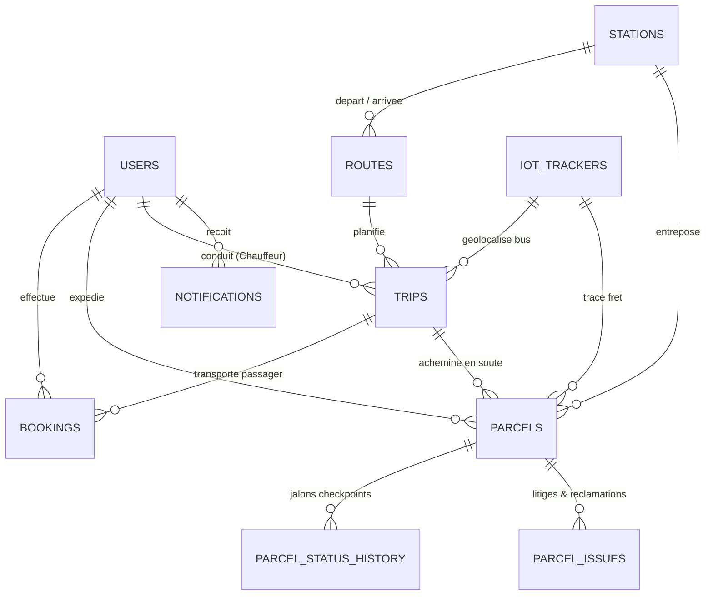

# 🚍 Global Voyages (SmartBus) — Système Intégré de Billetterie VIP, Suivi de Colis & Télémétrie IoT

Système complet de gestion de transport interurbain et de logistique de fret pour la ligne express **Douala ↔ Yaoundé (Axe Lourd N3)**, développé en **PHP 8 moderne (PDO)** avec support **MySQL / MariaDB** et **SQLite**, interface élégante **Tailwind CSS**, icônes vectorielles **Lucide SVG**, cartographie **Carto Voyager HD** et paiements automatisés **CamPay Mobile Money (MTN MoMo & Orange Money)**.

---

## 📑 Sommaire
1. [Vue d'ensemble & Architecture](#-vue-densemble--architecture)
2. [Prérequis Système](#-prérequis-système)
3. [Installation & Configuration de la Base de Données MySQL](#-installation--configuration-de-la-base-de-données-mysql)
   - [Méthode A : Avec phpMyAdmin (Interface Graphique XAMPP/WAMP)](#méthode-a--avec-phpmyadmin-interface-graphique-xamppwamp)
   - [Méthode B : En Ligne de Commande MySQL (CLI)](#méthode-b--en-ligne-de-commande-mysql-cli)
   - [Méthode C : Migration Automatisée en Ligne de Commande PHP](#méthode-c--migration-automatisée-en-ligne-de-commande-php)
4. [Bascule entre MySQL et SQLite (`config.php`)](#-bascule-entre-mysql-et-sqlite-configphp)
5. [Démarrage du Serveur Web](#-démarrage-du-serveur-web)
6. [Comptes & Rôles Pré-configurés](#-comptes--rôles-pré-configurés)
7. [Structure de la Base de Données (10 Tables)](#-structure-de-la-base-de-données-10-tables)
8. [Fonctionnalités Principales](#-fonctionnalités-principales)
   - [Paiement Mobile Money Automatisé (CamPay)](#1-paiement-mobile-money-automatisé-campay)
   - [Cartographie Interactive Optionnelle (Carto HD)](#2-cartographie-interactive-optionnelle-carto-hd)
   - [Billets Électroniques & Bordereaux Imprimables](#3-billets-électroniques--bordereaux-imprimables)
   - [Bilinguisme Intégral (Français / Anglais)](#4-bilinguisme-intégral-français--anglais)
9. [Dépannage & FAQ](#-dépannage--faq)

---

## 🏛️ Vue d'ensemble & Architecture

Le système **Global Voyages SmartBus** est conçu pour répondre aux normes des compagnies de transport interurbain au Cameroun et en Afrique Centrale.

```
smartbus/
├── PHP-App/
│   ├── config/
│   │   ├── config.php          # Paramètres de connexion (DB_TYPE, CamPay, Carto, Langues)
│   │   └── database.php        # Singleton PDO pour MySQL & SQLite
│   ├── database/
│   │   ├── schema_mysql.sql    # Schéma DDL complet pour MySQL / MariaDB (InnoDB, utf8mb4)
│   │   ├── schema.sql          # Schéma DDL pour SQLite
│   │   ├── migrate.php         # Script CLI de migration et initialisation des données
│   │   └── smartbus.sqlite     # Base SQLite autonome (prête à l'emploi)
│   ├── public/
│   │   ├── index.php           # Page d'accueil publique (Recherche, Réservation, Suivi)
│   │   ├── login.php           # Authentification unique multi-rôles
│   │   ├── logout.php          # Déconnexion et nettoyage de session
│   │   ├── ticket.php          # Titre de transport électronique avec QR Code & Code-barres
│   │   ├── waybill.php         # Bordereau d'expédition fret & colis officiel
│   │   ├── admin/index.php     # Tableau de bord Administrateur
│   │   ├── agent/index.php     # Guichet Agent (Réservations & Réception Colis)
│   │   ├── driver/index.php    # Cockpit Chauffeur (Feuille de route & Incidents)
│   │   ├── customer/index.php  # Espace Passager / Client
│   │   ├── api/                # Endpoints REST (Campay, Trajets, Sièges, Suivi)
│   │   └── js/                 # Logique client (Booking, Polling CamPay, Leaflet)
│   └── src/
│       ├── Auth.php            # Gestion des sessions, permissions RBAC et CSRF
│       ├── CamPay.php          # Service cURL API CamPay Mobile Money
│       └── Language.php        # Dictionnaire bilingue dynamique (FR / EN)
```

---

## ⚙️ Prérequis Système

Pour exécuter l'application avec MySQL :
- **PHP** : Version 8.1 ou supérieure (idéalement PHP 8.2+).
- **Extensions PHP requises** :
  - `pdo_mysql` (pour MySQL / MariaDB)
  - `pdo_sqlite` (pour le mode SQLite alternatif)
  - `curl` (pour la communication avec l'API CamPay)
  - `mbstring` et `openssl` (sécurité et encodage)
- **Serveur de Base de Données** :
  - MySQL 5.7+ / MySQL 8.x **OU** MariaDB 10.3+
  - Inclus par défaut dans **XAMPP**, **WampServer**, ou **Docker**.

> [!TIP]
> Si vous utilisez **XAMPP sur Windows**, PHP et MySQL sont déjà installés dans `C:\xampp\php\php.exe` et `C:\xampp\mysql`.

---

## 🗄️ Installation & Configuration de la Base de Données MySQL

Trois méthodes simples s'offrent à vous pour créer la base de données `smartbus_db`.

---

### Méthode A : Avec phpMyAdmin (Interface Graphique XAMPP/WAMP)

1. **Démarrer les services** :
   - Ouvrez le panneau de configuration **XAMPP Control Panel**.
   - Cliquez sur **Start** en face du module **Apache** et en face du module **MySQL**.

2. **Accéder à phpMyAdmin** :
   - Ouvrez votre navigateur et accédez à : [http://localhost/phpmyadmin](http://localhost/phpmyadmin) (ou `http://127.0.0.1/phpmyadmin`).

3. **Créer la base de données** :
   - Dans le menu de gauche, cliquez sur **Nouvelle base de données** (ou onglet *Databases*).
   - Nom de la base : `smartbus_db`.
   - Interclassement (Collation) : choisissez `utf8mb4_unicode_ci` (ou `utf8mb4_general_ci`).
   - Cliquez sur le bouton **Créer**.

4. **Importer le Schéma SQL** :
   - Cliquez sur la base `smartbus_db` nouvellement créée dans le panneau de gauche.
   - Cliquez sur l'onglet **Importer** en haut.
   - Cliquez sur **Choisir un fichier** et sélectionnez le fichier :
     ```
     smartbus/PHP-App/database/schema_mysql.sql
     ```
   - Laissez les options par défaut et cliquez sur le bouton **Importer** (ou *Exécuter*) tout en bas.
   - *Toutes les 10 tables sont alors créées avec succès.*

5. **Peupler avec les données de démonstration** :
   - Ouvrez un terminal dans le dossier `smartbus/PHP-App` et lancez :
     ```bash
     php database/migrate.php
     ```
   - Vos 2 gares VIP (Douala Akwa & Yaoundé Mvan), les trajets du jour, les utilisateurs et les balises IoT sont immédiatement injectés.

---

### Méthode B : En Ligne de Commande MySQL (CLI)

Si vous préférez la ligne de commande ou êtes sur un serveur distant :

1. **Connexion à MySQL** :
   ```bash
   mysql -u root -p
   ```
   *(Appuyez sur Entrée si votre utilisateur `root` n'a pas de mot de passe, comme par défaut sur XAMPP).*

2. **Création de la base de données** :
   ```sql
   CREATE DATABASE IF NOT EXISTS smartbus_db CHARACTER SET utf8mb4 COLLATE utf8mb4_unicode_ci;
   EXIT;
   ```

3. **Importation directe du schéma** :
   ```bash
   # Depuis la racine du projet smartbus :
   mysql -u root -p smartbus_db < PHP-App/database/schema_mysql.sql
   ```

4. **Exécution du seeder** :
   ```bash
   cd PHP-App
   php database/migrate.php
   ```

---

### Méthode C : Migration Automatisée en Ligne de Commande PHP

Le script `PHP-App/database/migrate.php` est **clé en main**. Si votre base de données `smartbus_db` est déjà créée dans MySQL, il configure la totalité des tables, relations, et jeux de données en une seule commande :

1. Assurez-vous que MySQL est actif sur le port `3306`.
2. Ouvrez `PHP-App/config/config.php` et vérifiez :
   ```php
   define('DB_TYPE', 'mysql');
   ```
3. Exécutez :
   ```bash
   cd PHP-App
   php database/migrate.php
   ```

**Sortie attendue :**
```text
=== SmartBus PHP Database Migration & Clean Seeder (Douala <-> Yaoundé Only) ===
Target Database Engine: MySQL / MariaDB (127.0.0.1:3306 / smartbus_db)
[OK] Schema structure verified and applied successfully.
[OK] Set exactly 2 stations: Douala (Akwa) and Yaoundé (Mvan).
[OK] Set exactly 2 routes: Douala ➔ Yaoundé and Yaoundé ➔ Douala.
[OK] Verified all users (debora / Demodebora, etc.).
[OK] Seeded 4 IoT Trackers.
[OK] Seeded Douala <-> Yaoundé VIP trips for today and tomorrow.
[OK] Seeded sample paid bookings.
[OK] Seeded sample parcel PAR-2026-00125 with checkpoint history.
=== Migration Complete ===
```

---

## 🔄 Bascule entre MySQL et SQLite (`config.php`)

Le système est doté d'une couche d'abstraction PDO hybride. Pour basculer entre **MySQL** et **SQLite**, il vous suffit d'ajuster la directive `DB_TYPE` dans le fichier :
[`PHP-App/config/config.php`](file:///c:/Users/hp/git/smartbus/PHP-App/config/config.php).

### Configuration pour MySQL (XAMPP / Serveur Dédié / Production)
```php
define('DB_TYPE', 'mysql');
define('DB_HOST', '127.0.0.1');
define('DB_PORT', '3306');
define('DB_NAME', 'smartbus_db');
define('DB_USER', 'root');
define('DB_PASS', ''); // Renseignez votre mot de passe MySQL si configuré
```

### Configuration pour SQLite (Zéro Configuration / Portable)
```php
define('DB_TYPE', 'sqlite');
define('DB_SQLITE_PATH', __DIR__ . '/../database/smartbus.sqlite');
```

> [!NOTE]
> En mode SQLite, aucune installation de serveur MySQL n'est nécessaire. Le fichier `smartbus.sqlite` fonctionne instantanément avec toutes les fonctionnalités.

---

## 🚀 Démarrage du Serveur Web

### Option 1 : Serveur Interne PHP (Recommandé pour le développement)

Ouvrez un terminal ou PowerShell dans le dossier `PHP-App` :
```bash
cd c:\Users\hp\git\smartbus\PHP-App
php -S 127.0.0.1:8000 -t public
```

Ouvrez ensuite votre navigateur sur :
👉 **[http://localhost:8000](http://localhost:8000)** (ou `http://127.0.0.1:8000`)

### Option 2 : Via Apache XAMPP / WampServer

1. Copiez ou clonez le dossier `smartbus` dans votre répertoire web :
   - Pour XAMPP : `C:\xampp\htdocs\smartbus`
2. Configurez un VirtualHost ou accédez à :
   `http://localhost/smartbus/PHP-App/public/`

---

## 👥 Comptes & Rôles Pré-configurés

Pour faciliter les tests et l'évaluation, des comptes pour chaque acteur du système sont pré-enregistrés :

| Rôle Métier | Nom d'utilisateur | Mot de passe | Tableau de Bord & URL | Périmètre d'action |
|---|---|---|---|---|
| **Administrateur** | `debora` | `Demodebora` | [`/admin/index.php`](http://localhost:8000/admin/index.php) | Supervision globale, chiffre d'affaires, flotte, balises IoT, création de trajets et utilisateurs. |
| **Agent Fret / Colis** | `agent_douala` | `password123` | [`/agent/index.php?tab=parcels`](http://localhost:8000/agent/index.php?tab=parcels) | Enregistrement des colis, pesée, association de balises GPS, impression des bordereaux. |
| **Agent Billetterie** | `agent_douala` | `password123` | [`/agent/index.php?tab=bookings`](http://localhost:8000/agent/index.php?tab=bookings) | Vente au guichet, attribution de sièges VIP, encaissement direct. |
| **Chauffeur VIP** | `paul_driver` | `password123` | [`/driver/index.php`](http://localhost:8000/driver/index.php) | Feuille de route du car, manifeste passagers, signalement d'incidents de trajet. |
| **Passager / Client** | `alice_customer` | `password123` | [`/customer/index.php`](http://localhost:8000/customer/index.php) | Historique personnel des réservations, téléchargement des billets, suivi des colis. |

---

## 🗃️ Structure de la Base de Données (10 Tables)

La base de données MySQL `smartbus_db` est structurée selon les règles strictes de normalisation relationnelle avec clés étrangères (`FOREIGN KEY`) et cascades :



1. **`users`** : Comptes d'utilisateurs avec hashage sécurisé `PASSWORD_DEFAULT` (`ADMIN`, `PARCEL_AGENT`, `BOOKING_AGENT`, `DRIVER`, `CUSTOMER`).
2. **`stations`** : Gares routières (Gare Centrale Douala Akwa et Terminal Yaoundé Mvan) avec coordonnées GPS, adresse et téléphone.
3. **`routes`** : Itinéraires express officiels (N3 Axe Lourd : 242 km, ~3.5 h).
4. **`iot_trackers`** : Balises GPS 4G professionnelles (`GV-GPS-4G-Pro`), niveau de batterie, statut de disponibilité, vitesse en km/h et coordonnées instantanées.
5. **`trips`** : Départs d'autocars VIP programmés, affectation du bus, chauffeur, heures de départ et tarifs.
6. **`bookings`** : Billets passagers, numéro de siège VIP, statut de paiement, identifiant transaction CamPay et données passager.
7. **`parcels`** : Expéditions de colis, expéditeur, destinataire, valeur déclarée, poids, statut logistique et balise IoT rattachée.
8. **`parcel_status_history`** : Historique traçable des checkpoints (Reçu en gare, Chargé en soute, En transit, Arrivé).
9. **`parcel_issues`** : Gestion des réclamations, pertes, retards ou dégradations.
10. **`notifications`** : Alertes push internes pour les utilisateurs (retards, paiements confirmés, alertes GPS).

---

## ⚡ Fonctionnalités Principales

### 1. Paiement Mobile Money Automatisé (CamPay)
- **Collecte Push USSD** : En saisissant son numéro Orange Money ou MTN MoMo (9 chiffres camerounais), une demande de débit est envoyée en temps réel via l'API CamPay.
- **Détection Automatique (Zero Clic de test)** : Le client valide le code PIN sur son propre téléphone (`*126#` ou `#150*50#`). Le système sonde automatiquement l'API en arrière-plan toutes les 2 secondes et détecte le succès sans aucune intervention manuelle.
- **Webhook de Secours** : Un endpoint dédié [`/api/campay_webhook.php`](file:///c:/Users/hp/git/smartbus/PHP-App/public/api/campay_webhook.php) écoute les notifications serveur-à-serveur instantanées de CamPay.
- **Verrouillage de Sécurité** : Les boutons d'impression et de téléchargement du billet sont strictement masqués tant que le paiement n'est pas confirmé `PAID`.

### 2. Cartographie Interactive Optionnelle (Carto HD)
- **Affichage à la Demande** : La carte est masquée par défaut pour un chargement instantané de l'interface. Un simple clic sur le bouton **"Voir sur la carte / See on map"** déploie la cartographie.
- **Clé API Carto Voyager HD** : Couche cartographique haute définition nette et sans filigrane d'erreur API.
- **4 Fonds de Cartes Disponibles** : Voyager HD, Positron, Dark Matter, et OpenStreetMap standard.

### 3. Billets Électroniques & Bordereaux Imprimables
- **Boarding Pass Passager ([`ticket.php`](file:///c:/Users/hp/git/smartbus/PHP-App/public/ticket.php))** : Titre de transport VIP avec code-barres SVG, QR Code de contrôle, rappel des conditions de voyage et format d'impression CSS propre (Ctrl+P / Imprimer).
- **Bordereau de Fret Officiel ([`waybill.php`](file:///c:/Users/hp/git/smartbus/PHP-App/public/waybill.php))** : Feuille de colisage avec détails du transporteur, scellé de sécurité, valeurs d'assurance, et zones d'émargement au départ et à l'arrivée.

### 4. Bilinguisme Intégral (Français / Anglais)
- Sélecteur de langue dans la barre supérieure (`?lang=fr` ou `?lang=en`).
- Persistance transparente en variable de session PHP (`$_SESSION['lang']`).
- Traduction de 100% des formulaires, tableaux de bord, messages d'état, boutons et notifications.

### 5. Design Moderne & Zéro Emoji
- Remplacement intégral des émojis par des icônes vectorielles SVG **Lucide**.
- Interface responsive optimisée pour smartphone, tablette et écran de bureau.

---

## 🔧 Dépannage & FAQ

### Q1 : Erreur `SQLSTATE[HY000] [1049] Unknown database 'smartbus_db'`
> **Cause** : La base de données MySQL n'a pas encore été créée dans MySQL.  
> **Solution** : Ouvrez phpMyAdmin ou MySQL CLI et exécutez `CREATE DATABASE smartbus_db CHARACTER SET utf8mb4 COLLATE utf8mb4_unicode_ci;`, puis relancez `php database/migrate.php`.

### Q2 : Erreur `Access denied for user 'root'@'localhost'`
> **Cause** : Votre serveur MySQL requiert un mot de passe pour l'utilisateur `root`.  
> **Solution** : Renseignez votre mot de passe dans `PHP-App/config/config.php` à la ligne `define('DB_PASS', 'votre_mot_de_passe');`.

### Q3 : Erreur `Call to undefined function curl_init()`
> **Cause** : L'extension PHP cURL est désactivée dans votre configuration `php.ini`.  
> **Solution** : Dans votre fichier `php.ini`, retirez le point-virgule devant `;extension=curl` pour obtenir `extension=curl`, puis redémarrez votre serveur PHP / Apache.

### Q4 : Comment revenir au mode SQLite si MySQL est arrêté ?
> **Solution** : Ouvrez `PHP-App/config/config.php` et modifiez simplement la ligne 18 :
> ```php
> define('DB_TYPE', 'sqlite');
> ```
> L'application bascule instantanément sur la base de données embarquée sans aucune perte de données.

---

## 📜 Licence & Crédits
- **Développé pour** : Global Voyages Cameroun Express
- **Technologies** : PHP 8, MySQL, SQLite PDO, Tailwind CSS, Lucide Icons, Leaflet OpenStreetMap & Carto, CamPay API.
- **Axe de Déploiement** : Corridor National N3 Douala ↔ Yaoundé.
